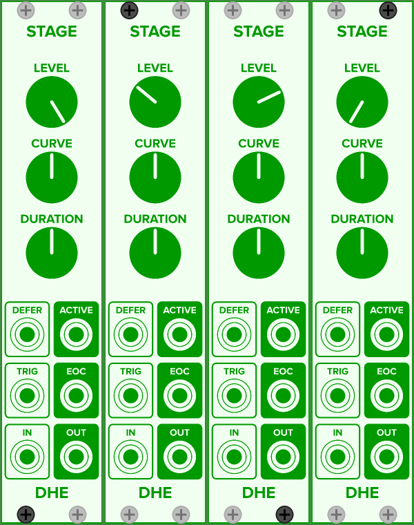
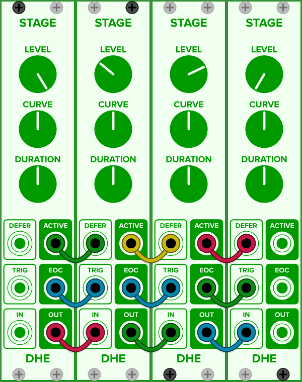
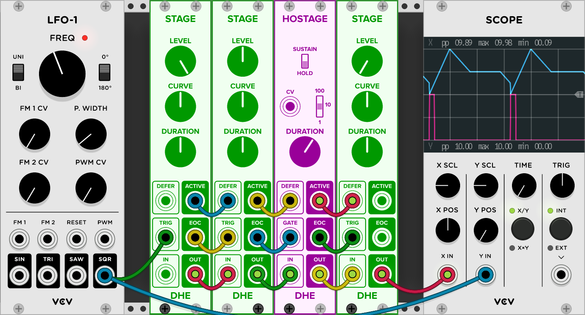
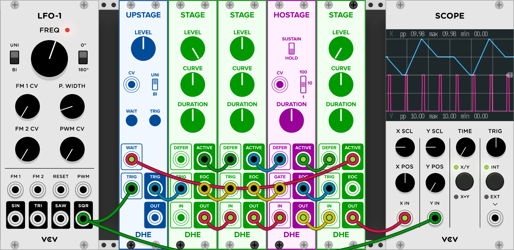
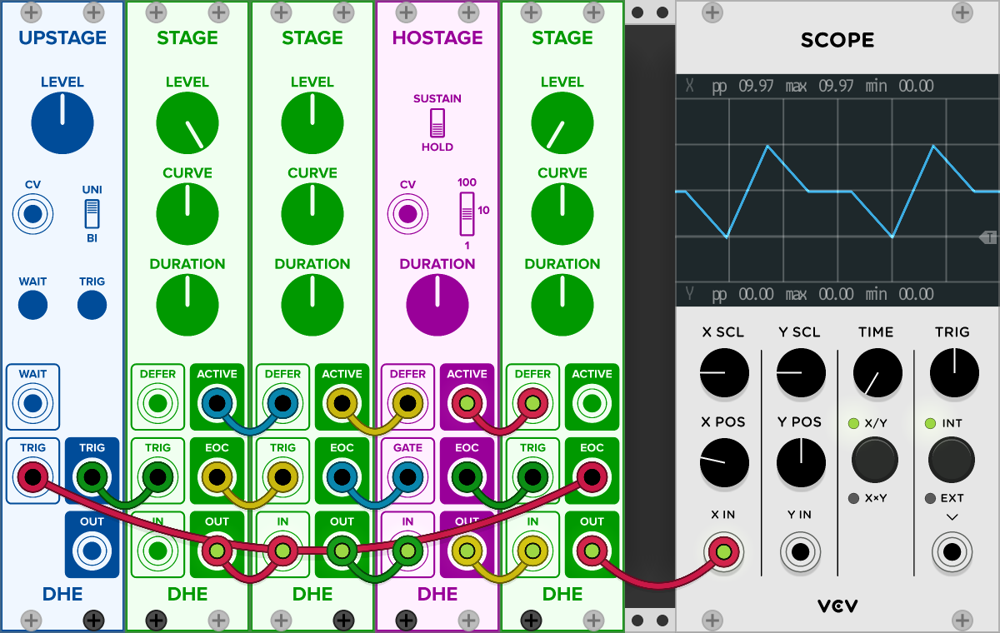
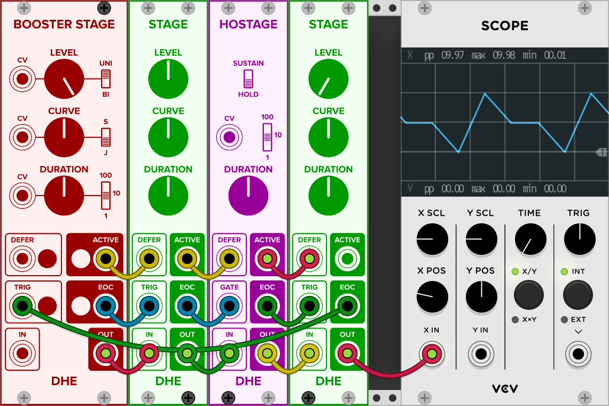

- [Wiring a Multi-Stage Envelope](#wiring).
- [Setting Levels](#levels).
- [Adding a Hold Stage](#hold).
- [Adding a Sustain Stage](#sustain).
- [Making Envelopes Retriggerable](#retriggerable).
- [Making Envelopes Uninterruptible](#uninterruptible).
- [Creating a Looping Envelope](#loops).
- [Variations](#variations).

**See also:**
- [How Stages Work Together](/technical/how-stages-work-together).
- [Generating Multi-Stage Envelopes](/guides/generating-multi-stage-envelopes).
- [Generating Single-Stage Envelopes](/guides/generating-multi-stage-envelopes).

## Wiring a Multi-Stage Envelope

The usual way to wire
[_Stage_](/modules/stage/),
[_Booster Stage_](/modules/booster-stage/),
[_Hostage_](/modules/hostage/),
and [_Upstage_](/modules/upstage/)
modules
into multi-stage envelopes is:

1. **Place the modules side-by-side in the order you want them to execute.**
1. **Connect each output to the input on its right.**

For example,
suppose you want generate a four-stage envelope using _Stage_ modules:

Notice how:
- The _ACTIVE_ outputs line up with the _DEFER_ inputs.
- The _EOC_ outputs line up with the _TRIG_ inputs.
- The _OUT_ outputs line up with the _IN_ inputs.

That is your clue to wiring the modules together:

- Connect each module's _ACTIVE_ output
    to its successor's _DEFER_ input.
- Connect each module's _EOC_ output
    to its successor's _TRIG_ input.
- Connect each module's _OUT_ output
    to its successor's _IN_ input.

Here is the result:

Now all that remains is to
connect a trigger source to the first stage,
connect the final stage's output
to whatever parameter you want your envelope to modulate,
and adjust the levels, curves, and durations to taste.

**Note:**
_Hostage_ has a _GATE_ port instead of a _TRIG_ port.
_Upstage_ has a different set of ports.
But even these modules' ports are arranged
so that the usual wiring scheme —
"connect each module's outputs to its successor's inputs" —
usually applies.
See the examples below for details and exceptions.

## Setting Levels

- Each module's _LEVEL_ knob
    determines the _ending_ level
    of the stage it generates.

- The starting voltage of each stage
    is determined by the signal
    arriving at its _IN_ input
    at the instant it is triggered.

- In this way,
    each stage begins
    where its predecessor ends.

- So to set each module's starting level,
    set the previous stage's
    ending level.

## Adding a Hold Stage

The _Hostage_ module is designed specifically
to create hold and sustain stages.

A _hold stage_
holds the envelope voltage constant
_for a given duration._

With a hold stage,
you can generate an
[Attack-Hold-Release](/guides/generating-multi-stage-envelopes#ahr)
or
[Attack-Decay-Hold-Release](/guides/generating-multi-stage-envelopes#adhr)
Envelope.

To generate a hold stage with _Hostage:_

- Wire it into the chain of modules
    in the position where you want the the hold stage
- Set its mode to _HOLD._

_Hostage_ holds the voltage
at the level where the previous stage ended.
It offers a knob, a range switch, and _CV_ modulation
to set the duration of the hold stage.

## Adding a Sustain Stage

The _Hostage_ module is designed specifically
to create hold and sustain stages.

A _sustain stage_
sustains a constant envelope voltage
_as long as the sustain gate is up._

With a sustain stage,
you can generate an
[Attack-Decay-Sustain-Release](/guides/generating-multi-stage-envelopes#adsr)
Envelope.

The wiring for a sustain stage
differs from the usual scheme.
Note the **bold text** below.

To generate a sustain stage with _Hostage:_

- Wire it into the chain of modules
    in the position where you want the the sustain stage.
- Set its mode to _SUSTAIN._
- **Connect its _GATE_ input
    to the same gate source
    that triggers the envelope.**

_Hostage_ sustains the voltage
at the level where the previous stage ended
as long as the gate remains up.

## Making Envelopes Retriggerable

Each multi-stage envelope shown in
[Generating Multi-Stage Envelopes](/guides/generating-multi-stage-envelopes)
is _retriggerable._
If a trigger arrives
while an envelope is in progress,
the new trigger
**_interrupts the in-progress envelope_**
and begins a new one.

The general rule of retriggering for
[_Stage_](/modules/stage/),
[_Booster Stage_](/modules/booster-stage/),
[_Hostage_](/modules/hostage/),
and [_Upstage_](/modules/upstage/)
modules is:

> **Unless you
[take steps to suppress retriggers](#uninterruptible)
while an envelope is in progress,
the envelope is retriggerable.**

For example,
here is a retriggerable ADHR envelope:

The cyan scope trace shows the envelope.
The magenta trace shows the incoming triggers.

Notice that when a new trigger arrives
while the release stage is still in progress,
the trigger interrupts the release stage
and starts a new envelope.

## Making Envelopes Uninterruptible

If you want to prevent incoming triggers
from interrupting in-progress envelopes:

- Insert an _Upstage_ at the front of the chain.
- Rewire the trigger source
    so that the trigger signal passes through _Upstage_
    rather than going directly to the first stage.
- Connect _Upstage's_ _WAIT_ input
    to the final stage's _ACTIVE_ output.

For example,
here is an uninterruptible ADHR envelope:

The cyan scope trace shows the envelope.
The magenta trace shows multiple triggers
arriving during each iteration of the envelope.

With this configuration,
whenever an envelope is in progress,
the final stage's _ACTIVE_ signal
tells _Upstage_ to suppress incoming triggers.
When the envelope finishes,
_Upstage_ resumes forwarding incoming triggers to the first stage.

## Looping Envelopes

To generate a looping envelope,
we need to
- Manually trigger the first envelope
- Configure the final stage
    to retrigger the envelope
    when it finishes

And we might want a way to stop or retrigger a looping envelope.

[_Upstage_](#upstage-loops) and [_Booster Stage_](#booster-stage-loops)
offer ways to control looping envelopes.

### Controlling Loops With _Upstage_

- [Configure](#wiring) a non-looping envelope in the usual way.
- Add an _Upstage_ before the first stage.
- Connect the final stage's _EOC_ output to _Upstage's_ _TRIG_ input.
- Connect _Upstage's_ _TRIG_ output to the first stage's _TRIG_ input.

Here is a looping ADHR envelope using _Upstage:_

You can use _Upstage's_ buttons
to start, stop, and retrigger the loop.

- **To start the loop:**
    Press the _TRIG_ button.
- **To retrigger the loop:**
    Press the _TRIG_ button
    while the envelope is running.
- **To stop the loop:**
    Press the _WAIT_ button
    and hold it
    until the final stage finishes.

**Weird Fact:**
You an also stop the loop
by pressing the _TRIG_ button
(causing the loop to restart)
and holding it until the final stage finishes.

### Controlling Loops With _Booster Stage_

- [Configure](#wiring) a non-looping envelope in the usual way,
    **using a _Booster Stage_ as the first stage.**
- Connect the final stage's _EOC_ output to _Booster Stage's_ _TRIG_ input.

Here is a looping ADHR envelope using _Booster Stage:_

You can use _Booster Stage's_ buttons
to start, stop, and retrigger the loop.

- **To start the loop:**
    Press the _TRIG_ button.
- **To retrigger the loop:**
    Press the _TRIG_ button
    while the envelope is running.
- **To stop the loop:**
    Press and hold any _Booster Stage_ button
    until the loop stops.

I leave it as an exercise for the reader
to discover
when and at what voltage
each button stops the envelope.

If you want a gentler, more controlled stop,
[use _Upstage_ and its _WAIT_ button](#upstage-loops)
to control the loop.

## Variations
- For additional versatility,
    replace any _Stage_ module with a
    [_Booster Stage_](/modules/booster-stage/).
- To start each envelope at a level other than 0V,
    connect an
    [_Upstage_](/modules/upstage/)
    or other voltage source.
- To start each envelope
    at the level where the previous one ended,
    connect the the final stage's _OUT_ output
    to the first stage's _IN_ input.
- Follow Artur Karlov's lead and
    [make a sick kick](https://www.youtube.com/watch?v=jVLEKn55MGg).
- Generate audible waveforms
    by [configuring a loop](#loops)
    with very short durations.
- Generate an envelope with seventeen stages.
- Configure a stage to trigger two or more successor stages.
- Vary something.
- Vary something else.
