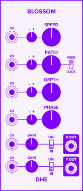

Blossom
traces a point
around the edge of a circle
as the radius of the circle varies.

The resulting two-dimensional shape
generates a pair of complex, evolving, pulsing LFO signals.

# Controls
- **SPEED:**
    The speed at which the point
    traces around the circle.

- **RATIO:**
    The number of times
    the radius bounces in and out
    on each rotation.

- **FREE / LOCK:**
    Determines whether to round the _BOUNCE_ value
    to the nearest integer.

    _LOCK_ rounds the _RATIO_
    to the nearest integer,
    causing _Blossoms's_ pattern of accents
    to repeat on every rotation.

    _FREE_ allows non-integer _BOUNCE_ values,
    which lets the accents
    vary from one rotation to the next.

- **DEPTH:**
    How far the radius bounces
    from the outer edge of the shape.
    This determines
    the dominance of the bounce effect
    in the output signals.

- **PHASE:**
    Offsets the phase of the bounce cycle.

    This has the effect
    of shifting where the accents
    occur on each rotation.

# Ports
- **X OUT** and **Y OUT:**
    The output signals.

    The polarity switch **(UNI / BI)**
    selects the voltage range of the associated output signal.
    0 to 10V (UNI)
    or -5 to 5V (BI).

    The **GAIN** knob applies gain (from 0 to 2)
    to the signal.

    _Blossom_ selects the range before applying the gain.

- **CV:**
    A [control voltage](/technical/modulation/) signal
    to modulate the associated parameter.  Some CV signals have attenuverters.

# Plotting Blossom

When plotted on a two-dimensional graph,
Blossom's _X_ and _Y_ signals
produce a visually pleasing, flower-like shape.

To view the shape that Blossom produces, connect its _X_ and _Y_ outputs to a
Scope's _X_ and _Y_ inputs.  Set the scope to _X x Y_ mode.  Note that the
scope's _X/Y_ mode can also be interesting.
