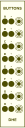

8 toggle buttons with momentary negation.

## Controls
-   **Toggle Button (A–H):**
    Toggles between true (10V) and false (0V).

-   **Negate Button (¬):**
    Negates the truth value while pressed.

&nbsp;

&nbsp;

&nbsp;

&nbsp;

&nbsp;

&nbsp;

&nbsp;

&nbsp;
