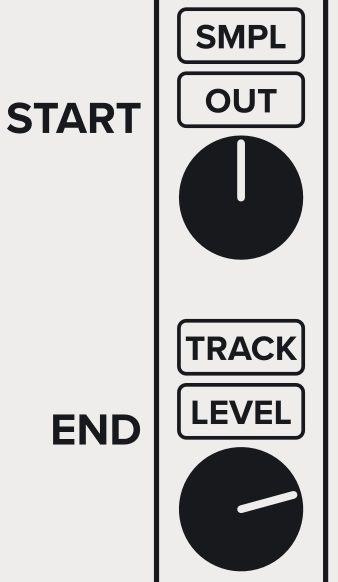
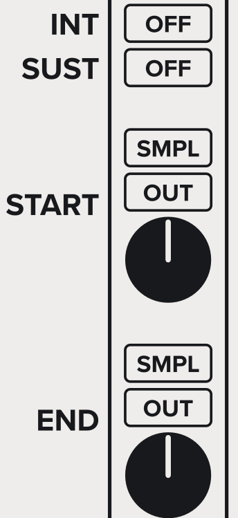
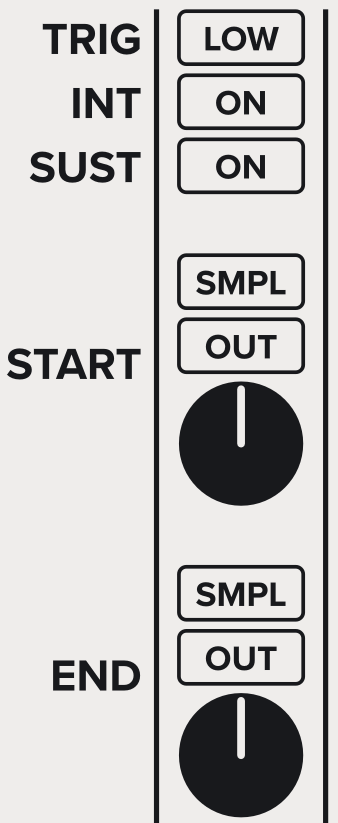
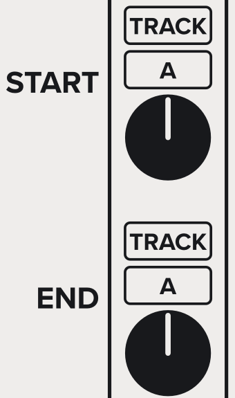
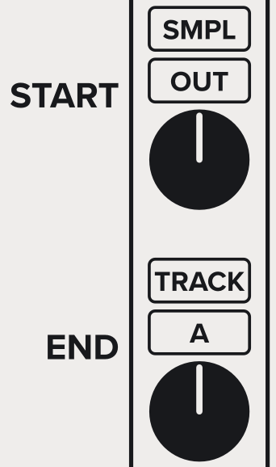
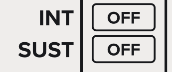

The Curve Sequencer modules are deprecated.
This guide explains how to convert a Curve Sequencer preset
to use a [Sequencizer](/modules/sequencizer) instead.

The key differences between Curve Sequencer and Sequencizer:
- Curve Sequencer uses ["generate modes"](#converting-generate-modes) to specify the starting and ending voltages for each step. Sequencizer uses two flexible voltage sources called "anchors," one defining the step's starting voltage and the other defining the ending voltage.
- Curve sequencer uses ["advance modes"](#converting-advance-modes) to define the conditions under which the sequence exits the current step and advances to the next. Sequencizer uses a flexible combination of trigger, interrupt, and sustain controls to determine when the sequence advances.

See:
- [The Sequencizer Modules](/modules/sequencizer/) for detailed descriptions of Sequencizer's controls.
- [Sequencizer User Guide](/modules/sequencizer/user-guide) for ideas about how to use the Sequencizer modules.

# Converting Generate Modes
In Curve Sequencer, the generate mode determines what kind of curve the step produces. In Sequencizer, the curve is determined by the START and END anchors, each of which has a source (LEVEL, A, B, C, or OUT) and a mode (SMPL or TRACK).

## Generate Mode: CURVE
In Curve Sequencer, curve mode generates a curve starting from whatever voltage the sequencer was emitting when the step started, and prograssing to the voltage set by the _LEVEL_ knob.

To achieve the same effect in [Sequencizer](/modules/sequencizer):

- Set the **START** anchor to SMPL OUT. When the step starts, it samples the voltage at the OUT port, and progresses from the sampled voltage.
- Set the **END** anchor to TRACK LEVEL, and set the end LEVEL knob to the desired voltage. The step progresses to the voltage set by the LEVEL knob.

## Generate Mode: HOLD
In Curve Sequencer, hold mode emits whatever voltage the sequencer was emitting when the step started.

To achieve the same effect in [Sequencizer](/modules/sequencizer):

- Set the **START** and **END** anchors to SMPL OUT. When the step starts, it samples the voltage at the OUT port, and emits the sampled voltage throughout.
- Turn **INT** Off. The step ignores the GATE input, and continues for the step's full duration.
- Turn **SUST** Off. When the current step's duration elapses, the sequence automatically advances to the next step.

## Generate Mode: SUST
In Curve Sequencer, sust mode emits whatever voltage the sequencer was emitting when the step started.

To achieve the same effect in [Sequencizer](/modules/sequencizer):

- Set **TRIG** to the desired gate condition. When the GATE input matches the condition, the step generates an internal trigger. For a traditional sustain mode, set this to LOW. But you can choose to advance on another GATE condition.
- Turn **INT** On. When the step generates an internal trigger, Sequencizer interrupts the step and advances to the next.
- Turn **SUST** On. When the current step's duration elapses, the step continues to emit the sampled voltage until interrupted.
- Set the **START** and **END** anchors to SMPL OUT. When the step starts, it samples the voltage at the OUT port, and emits the sampled voltage throughout.

## Generate Mode: INPUT
In Curve Sequencer, input mode emits the voltage at the IN port.

To achieve the same effect in [Sequencizer](/modules/sequencizer):

- Set the **START** and **END** anchors to TRACK A. The step emits the voltage at the A input port.

  You can also use the B or C input ports. Just set both the START and END anchors to TRACK the same input.

## Generate Mode: CHASE
In Curve Sequencer, chase mode "chases" the input by progressing from the sequence's current voltage to the voltage at the IN port.

To achieve the same effect in [Sequencizer](/modules/sequencizer):

- Set the **START** anchor to SMPL OUT. When the step starts, it samples the voltage at the OUT port, and progresses from the sampled voltage.
- Set the **END** anchor to TRACK A. The step progresses toward the voltage at the A input port. You can also use the B or C input ports.

# Converting Advance Modes
In Curve Sequencer, each step's advance mode determines when the sequence advances from the current step to the next. In Sequencizer, advancement is controlled by the TRIG, INT, and SUST controls.

## Advance Mode: TIME
In Curve Sequencer, time mode causes the step to proceed for its full duration, regardless of what happens at the _GATE_ input. The sequence then automatically advances to the next step.

To achieve the same effect in [Sequencizer](/modules/sequencizer):

- Turn **INT** Off. The step ignores the _GATE_ input, and continues for the step's full duration.
- Turn **SUST** Off. When the step's duration elapses, the sequence automatically advances to the next step.

## Advance Mode: RISE, FALL, EDGE, HIGH, and LOW
In Curve Sequencer, when the _GATE_ condition matches the selected advance mode, the current step is interrupted, and the sequence advances to the next step.

To achieve the same effect in [Sequencizer](/modules/sequencizer):

- Set **TRIG** to the desired condition. When the _GATE_ input matches the condition, the step generates an internal trigger.
- Turn **INT** On. When the current step generates an internal trigger, Sequencizer interrupts the step and advances to the next.
