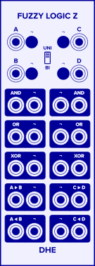

_Fuzzy Logic Z_ combines signals by applying fuzzy logic operators
based on Lofti Zadeh's definitions.

_Fuzzy Logic Z_ is arranged in two independent columns
with identical functionality.
Only the left column, which operates on the A and B inputs, is described below.
The right column applies the same operators to the C and D inputs.

**WARNING:**
_Fuzzy Logic Z_
can produce **very large output voltages**
if the input voltages
are above or below the selected range.
Please ***[READ THE WARNINGS CAREFULLY](#warnings)!***

# Controls
- **¬ button:**
  Negates the corresponding input
  by applying the _NOT_ unary operator
  before applying the binary operators.
  _NOT(x)_ is defined as _1-x_.

- **UNI / BI:**
    The input voltage range for which _Fuzzy Logic Z_ is well-behaved.
    0 to 10V (UNI)
    or -5 to 5V (BI).

    If the input signals are within the selected range,
    the output signals will also be within the selected range.

    Input signals
    above or below the selected range
    **[can produce very large output voltages](#warnings).**

# Ports
- **A** and **B**:
    The inputs to the operators.

- **AND:**
  emits _min(A,B)_.

- **OR:**
  emits _max(A,B)_.

- **XOR:**
  emits _A+B-2*min(A,B)_.

- **A &#x25b6; B** (A implies B):
  emits _1-min(A,1-B)_.

- **A &#x25c0; B** (B implies A):
  emits _1-min(1-A,B)_.

- **¬ port**:
  Emits the negation of the operator it is grouped with.
  _NOT(x)_ is defined as _1-x_.

# Usage Ideas

- **Disconnected inputs.**
  Leave one input disconnected.
  _Fuzzy Logic Z_ treates a disconnected input
  as a 0V input signal.
  How it interprets 0V depends on the position of the range switch.
  In _UNI_ range (0V to 10V),
  0V means _absolutely false._
  In _BI_ range (-5V to 5V),
  0V means _half true_.

- **Sequences of Operators.**
  Send the outputs of the A/B column
  to the C and D inputs
  (or vice versa)
  to form compound logic expressions.

- **Feedback.**
  Connect one or both inputs of each column
  to outputs from the other column.
  This can generate very complex output signals
  from simple input signals.
  **WARNING:**
  If any input voltage is above or below the selected range,
  feedback loops like this can generate
  **[very high output voltages](#warnings).**

- **Alternate Fuzzy Logic.**
  For fuzzy logic based on the less common "hyperbolic paraboloid" fuzzy operators,
  try **[_Fuzzy Logic H_](/modules/fuzzy-logic-h/).**

# Voltage and Truth

- **Scaling the Inputs.**
  Before applying the operators,
  _Fuzzy Logic Z_ scales its inputs
  from the selected range
  to the "fuzzy logic" range \[0.0, 1.0\],
  where 0.0 means _completely false_,
  1.0 means _completely true_,
  and a value in between
  represents some degree of truth.

- **Scaling the Outputs.**
  After applying the fuzzy logic operators,
  _Fuzzy Logic Z_ scales each result
  to the range selected by the _UNI / BI_ switch.

- It may be interesting to consider
  the meaning
  of signals above or below the selected input range.
  More true than absolutely true?
  More false than absolutely false?
  If you connect input signals outside the selected range,
  be sure to heed the warnings below.

# Warnings

**_Fuzzy Logic Z_ can produce _VERY_ large output voltages
if the input voltages are above or below
the the range selected by the _UNI / BI_ switch.**

- _Fuzzy Logic Z_
  is well-defined and well-behaved for input signals
  within in its selected range.
  If both input signals are in the selected range,
  all output signals will be in the selected range.
- Input signals above or below the selected range
  can produce large output signals.
- Input signals even _moderately_ above or below the selected range
  can produce ***VERY*** large output signals.
- Feeding _Fuzzy Logic Z_'s outputs
  back into its inputs
  can produce ***VERY*** large output signals
  if the inputs are only _slightly_
  above or below the selected range.
  
