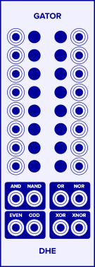

Computes eight common logic functions
for up to 16 inputs.

# Controls
- **Negate Buttons:**
  Beside each input is a _negate_ button
  that negates the input
  before computing the logic functions.

# Ports
- **Input ports:**
    The 16 logic inputs.
    A voltage above 0.5V (half a volt)
    is considered _true_.
    A voltage of 0.5V or below
    is considered _false_.

- **AND:**
  _True_ if every input is _true_.

- **NAND:**
  _True_ if at least one input is _false_.

- **EVEN:**
  _True_ if the number of _true_ inputs is even.

- **ODD:**
  _True_ if the number of _true_ inputs is odd.

- **OR:**
  _True_ if at least one input is _true_.

- **NOR:**
  _True_ if every input is _false_.

- **XOR:**
  _True_ if exactly one input is _true_.
  See the note below
  about [the meaning of _XOR_](#the-meaning-of-xor)
  for more than two inputs.

- **XNOR:**
  _True_ if the number of _true_ inputs is other than one.

# Notes

- **Inputs:**
  _Gator_ considers any input above 0.5V (half a volt)
  to be _true_,
  and any other voltage
  to be _false_.
- **Connected Inputs:**
  When computing the logic functions,
  _Gator_ considers only the *connected* inputs.
  If no inputs are connected,
  _Gator_ emits 0V on all _OUT_ ports.
- **Output:**
  Each _Gator_ output emits 10V
  if the corresponding logic function is _true_
  and 0V if the function is _false_.

# The Meaning of XOR

Opinions differ about the definition of "exclusive or" (XOR)
for more than two inputs:

1. Some people insist that it is undefined.
1. Some people insist that it is _true_ if the number of _true_ inputs is odd.
1. Some people insist that it is _true_ if exactly one input is _true_.

I chose the third definition (exactly one _true_ input) for _XOR_,
and added the _ODD_ output
to handle the second definition.
I left the first definition unimplemented.
At least, I think I did.
Frankly, there's no way to know.
