_Sequencizer_ may seem complex and daunting,
but it operates on a small number of powerful, flexible ideas:
[Phases, anchors, and advancement](#how-sequencizer-works).

The power of _Sequencizer_
comes from the great flexibility it offers.
You can combine these simple ideas
to generate an enormous variety
of precisely defined control signals
to modulate the devices
in your VCV Rack patches.

- [How Sequencizer Works](#how-sequencizer-works)
    - [Step Phases: Generate and Sustain](#step-phases-generate-and-sustain)
    - [Step Anchors: Start and End Voltages](#step-anchors-start-and-end-voltages)
    - [Advancing from One Step to the Next](#advancing-from-one-step-to-the-next)

- [Techniques](#techniques)
    - [Controlling Advancement](#controlling-advancement)
    - [Controlling Voltages](#controlling-voltages)
    - [Controlling Sequences](#controlling-sequences)

- [Examples](#examples)
    - [Envelope Generator Steps](#envelope-generator-steps)
        - [Attack Stage](#attack-stage)
        - [Hold Stage](#hold-stage)
        - [Decay Stage](#decay-stage)
        - [Sustain Stage](#sustain-stage)
        - [Release Stage](#release-stage)
    - [Step Sequencers](#step-sequencers)
        - [Externally-Clocked Step Sequencer](#externally-clocked-step-sequencer)
        - [Timer-Controlled Step Sequencer](#timer-controlled-step-sequencer)
    - [Sample and Hold Sequencers](#sample-and-hold-sequencers)
        - [Externally-Clocked Sample and Hold Sequencer](#externally-clocked-sample-and-hold-sequencer)
        - [Timer-Controlled Sample and Hold Sequencer](#timer-controlled-sample-and-hold-sequencer)

# How Sequencizer Works

## Step Phases: Generate and Sustain

1. **Generate Phase.**
    Each step starts by generating a signal
    that progresses
    from the _start anchor_ voltage
    to the _end anchor_ voltage.
    The generate phase always occurs,
    but may be interrupted
    by a trigger,
    depending on the **INT** control.
1. **Sustain Phase.**
    When a step finishes generating,
    it optionally sustains
    at the _end anchor_ voltage
    until a trigger occurs.
    The **SUST** control
    determines whether a step
    executes its sustain phase.

## Step Anchors: Start and End Voltages

A step _generates_
by interpolating
between the voltages
of its _start_ and _end anchor_
over its duration.
At any moment during the generate phase,
the step emits a voltage
that is part-way between the voltages
reported by these anchors.

An anchor's voltage
is determined by its _source_ and its _mode._

**Anchor Sources.**
An anchor can acquire its voltage from several sources,
selected by the **SOURCE** control
(the unnamed button above the anchor's knob):
- The _A_, _B_, or _C_ input port
- The _LEVEL_ controls
- The _OUT_ port
    (that is, _Sequencizer's_ previous output voltage)

**Anchor Modes.**
The **MODE** control
(the unnamed button below the anchor's knob)
determines _when_ the anchor acquires its voltage.

In SMPL mode,
the anchor _samples_ its source
exactly once,
at the start of the step,
and always reports
this sampled voltage.
Any changes in the source voltage
are ignored by the anchor
while the step generates.

In TRACK mode,
the anchor _tracks_ its source,
and always reports
the source's current voltage.

**Moving Targets.**
Note that if an anchor is tracking its source,
the anchor's voltage
can change while a step is active.
This means that the voltages
between which the step interpolates
can both be moving targets.

## Advancing from One Step to the Next

The _advancement_ controls
determine when the sequence advances
from one step to the next.

**Triggers.**
While a step is active
(whether generating or sustaining),
it watches the state of the _GATE_,
and generates an internal trigger
whenever the _GATE_
satisfies the condition
specified by the **TRIG** setting.
(RISE, FALL, EDGE, HIGH, or LOW)
The **INT** and **SUST** controls
determine how the step responds
to these internal triggers.

**Interrupting the Generate Phase.**
The **INT** control
specifies whether triggers interrupt the step.
If **INT** is ON,
a trigger that occurs while the step is generating:

- interrupts the generate phase
- bypasses the step's sustain phase
- advances to the next step

If **INT** is OFF,
the step ignores triggers during its generate phase.

**Sustaining.**
When a step finishes generating,
it optionally sustains
at the _end anchor_ voltage
until a trigger occurs.
If **SUST** is ON
when a step finishes generating,
the step sustains until a trigger occurs.
While it sustains,
it emits its _end anchor_ voltage.
If **SUST** is OFF,
the step skips its sustain phase,
and the sequence immediately advances to the next step.

# Techniques

## Controlling Advancement

_Sequencizer_ offers great flexibility and control
over how a sequence
advances from one step to the next.

<table>
    <tr>
        <th>Technique</th>
        <th>TRIG</th>
        <th>INT</th>
        <th>SUST</th>
        <th>Image</th>
        <th>Notes</th>
    </tr>
    <tr>
        <td>Externally Clocked</td>
        <td>any</td>
        <td>ON</td>
        <td>ON</td>
        <td>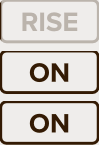</td>
        <td>Advance when the GATE condition is satisfied,
            regardless of what phase the step is executing.
            Useful for creating
            an externally-clocked step sequencer
            or a sample-and-hold step.
        </td>
    </tr>
    <tr>
        <td>Uninterruptible: Fixed Duration</td>
        <td>N/A</td>
        <td>OFF</td>
        <td>OFF</td>
        <td>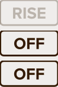</td>
        <td>Advance when the generate phase completes,
            regardless of the condition of the GATE.
            Useful for hold stages.</td>
    </tr>
    <tr>
        <td>Interruptible: Maximum Duration</td>
        <td>any</td>
        <td>ON</td>
        <td>OFF</td>
        <td>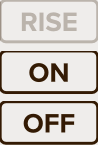</td>
        <td>Advance when the generate phase completes
            or when the GATE condition is satisfied,
            which ever happens first.
        </td>
    </tr>
    <tr>
        <td>Minimum Duration</td>
        <td>any</td>
        <td>OFF</td>
        <td>ON</td>
        <td>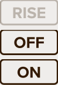</td>
        <td>Complete the generate phase,
            then sustain until the GATE condition is satisfied.
        </td>
    </tr>
    <tr>
        <td>Skippable</td>
        <td>LOW</td>
        <td>ON</td>
        <td>OFF</td>
        <td>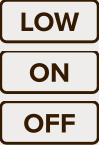</td>
        <td>Advance if the GATE is low at the start of the step
            or becomes low while the step is active.
            Useful for configuring
            a sequence of attack, decay, and sustain stages
            to jump immediately to the release stage
            when the GATE falls.
        </td>
    </tr>
    <tr>
        <td>Generate + Sustain</td>
        <td>LOW</td>
        <td>any</td>
        <td>ON</td>
        <td>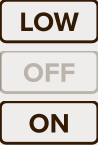</td>
        <td>Useful to combine decay and sustain in a single step.</td>
    </tr>
</table>

## Controlling Voltages

A step's anchors
define the voltages between which
the step interpolates during its generate phase.
Each anchor has two possible modes and five possible sources.
This gives 100 possible combinations.

Here are some of the more common configurations.

<table>
    <tr>
        <th>Technique</th>
        <th>Start Anchor</th>
        <th>End Anchor</th>
        <th>Image</th>
        <th>Notes</th>
    </tr>
    <tr>
        <td>Constant</td>
        <td>SMPL LEVEL</td>
        <td>TRACK OUT</td>
        <td></td>
        <td>Emit a specified constant voltage.
            Useful to create a step sequencer.</td>
    </tr>
    <tr>
        <td>Hold</td>
        <td>SMPL OUT</td>
        <td>TRACK OUT</td>
        <td></td>
        <td>Hold at the the previous step's final voltage.
            Useful for envelope sustain and hold stages.</td>
    </tr>
    <tr>
        <td>Sample and Hold</td>
        <td>SMPL any input</td>
        <td>TRACK OUT</td>
        <td></td>
        <td>Hold at the voltage sampled from an input.</td>
    </tr>
    <tr>
        <td>Fixed Ramp or Curve</td>
        <td>SMPL LEVEL</td>
        <td>SMPL LEVEL</td>
        <td></td>
        <td>Progress from one specified voltage to another.
            Useful for an envelope attack stage (0V to 10V).</td>
    </tr>
    <tr>
        <td>Continuation Ramp or Curve</td>
        <td>SMPL OUT</td>
        <td>SMPL LEVEL</td>
        <td></td>
        <td>Progress from the previous step's final voltage
            to a specified voltage.
            Useful for an envelope decay stage (set LEVEL to sustain voltage)
            or release stage (set LEVEL to 0V).
        </td>
    </tr>
    <tr>
        <td>Passthrough</td>
        <td>TRACK any input</td>
        <td>TRACK same input</td>
        <td></td>
        <td>Track and emit an input signal.</td>
    </tr><tr>
        <td>Fade In</td>
        <td>SMPL any source</td>
        <td>TRACK any input</td>
        <td></td>
        <td>Fade from the sampled voltage to the selected input signal.</td>
    </tr>
    <tr>
        <td>Fade Out</td>
        <td>TRACK any input</td>
        <td>SMPL any source</td>
        <td></td>
        <td>Fade from the selected input signal to the sampled voltage.</td>
    </tr>
    <tr>
        <td>Crossfade</td>
        <td>TRACK an input</td>
        <td>TRACK another input</td>
        <td></td>
        <td>Fade from one input signal to another.</td>
    </tr>
</table>

**NOTE:**
If you're surprised by
my advice to set the _end anchor_ to TRACK OUT
for the constant, hold, and sample and hold techniques,
consider:
This advice makes it easier to experiment with different start sources.
Every time you select a new start source,
the end anchor will automatically follow along.

**NOTE:**
If an anchor is set to TRACK its source,
the anchor's voltage
can change while the step is active.
This means that the voltages
between which the step interpolates
can both be moving targets.
This can create some very surprising, very creative results.
Experiment!

## Controlling Sequences

**Pausing a Sequence.**
To pause a sequence,
turn **RUN** off.

**Resuming a Sequence.**
To resume a paused sequence,
turn **RUN** on.

**Retriggering Envelopes.**
To retrigger an envelope
(that is, to interrupt an in-progress envelope and restart it from the beginning):
**send a rising edge to both _RESET_ and _GATE_ simultaneously.**
The rising _RESET_ interrupts the current step,
even if it is ignoring the _GATE_.
Then the rising _GATE_ immediately restarts the sequence.

Note that a rising _RESET_ signal
takes priority
over the steps' **INT** settings.
As a result,
a rising _RESET_ signal
interrupts even an "uninterruptible" step.

# Examples

## Envelope Generator Steps

### Attack Stage

<table>
    <tr>
        <th>Parameter</th>
        <th>Value</th>
        <th>Notes</th>
        <th>Image</th>
    </tr>
    <tr>
        <td>TRIG</td>
        <td>LOW</td>
        <td>If INT or SUST are ON,
            experiment with other GATE conditions here.
            If INT and SUST are both off,
            this setting does not matter.
        </td>
        <td rowspan="5">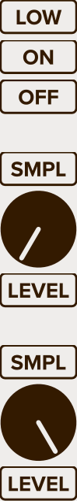</td>
    </tr>
    <tr>
        <td>INT</td>
        <td>ON</td>
        <td>This makes the step interruptible.
            Set INT OFF to make it uninterruptible.
        </td>
    </tr>
    <tr>
        <td>SUST</td>
        <td>OFF</td>
        <td>Variation:
            To combine the step with a sustain stage,
            turn SUST ON and set TRIG to LOW.
        </td>
    </tr>
    <tr>
        <td>Start Anchor</td>
        <td>SAMPL LEVEL</td>
        <td>The most common start voltage is 0V.
            Alternatively,
            use SAMPL OUT to start the attack at the previous step's final voltage.
        </td>
    </tr>
    <tr>
        <td>End Anchor</td>
        <td>SMPL LEVEL</td>
        <td>The most common start voltage is 10V.</td>
    </tr>
</table>

### Hold Stage

<table>
    <tr>
        <th>Parameter</th>
        <th>Value</th>
        <th>Notes</th>
        <th>Image</th>
    </tr>
    <tr>
        <td>TRIG</td>
        <td>LOW</td>
        <td>If INT or SUST are ON,
            experiment with other GATE conditions here.
            If INT and SUST are both off,
            this setting does not matter.
        </td>
        <td rowspan="6">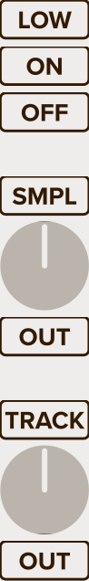</td>
    </tr>
    <tr>
        <td>INT</td>
        <td>ON</td>
        <td>This makes the step uninterruptible.
            Set INT ON to make it interruptible.
        </td>
    </tr>
    <tr>
        <td>SUST</td>
        <td>OFF</td>
        <td>Variation:
            To combine the step with a sustain stage,
            turn SUST ON and set TRIG to LOW.
            This turns it into a "hold for at least the specified duration" stage.
        </td>
    </tr>
    <tr>
        <td>Start Anchor</td>
        <td>SAMPL OUT</td>
        <td>To start the release at the previous step's final voltage.</td>
    </tr>
    <tr>
        <td>End Anchor</td>
        <td>TRACK OUT</td>
        <td>To continue emitting the sampled voltage.</td>
    </tr>
</table>

### Decay Stage

<table>
    <tr>
        <th>Parameter</th>
        <th>Value</th>
        <th>Notes</th>
        <th>Image</th>
    </tr>
    <tr>
        <td>TRIG</td>
        <td>LOW</td>
        <td>If INT or SUST are ON,
            experiment with other GATE conditions here.
            If INT and SUST are both off,
            this setting does not matter.
        </td>
        <td rowspan="6">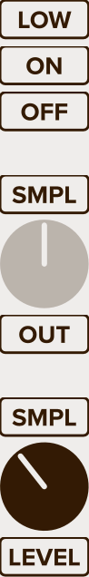</td>
    </tr>
    <tr>
        <td>INT</td>
        <td>ON</td>
        <td>This makes the step interruptible.
            Set INT OFF to make it uninterruptible.
        </td>
    </tr>
    <tr>
        <td>SUST</td>
        <td>OFF</td>
        <td>Variation:
            To combine the step with a sustain stage,
            turn SUST ON and set TRIG to LOW.
        </td>
    </tr>
    <tr>
        <td>Start Anchor</td>
        <td>SAMPL OUT</td>
        <td>To start the decay at the previous step's final voltage.</td>
    </tr>
    <tr>
        <td>End Anchor</td>
        <td>SMPL LEVEL</td>
        <td>Set the LEVEL to the desired sustain voltage.</td>
    </tr>
</table>

### Sustain Stage

<table>
    <tr>
        <th>Parameter</th>
        <th>Value</th>
        <th>Notes</th>
        <th>Image</th>
    </tr>
    <tr>
        <td>TRIG</td>
        <td>LOW</td>
        <td>The GATE condition that ends the sustain stage.</td>
        <td rowspan="6">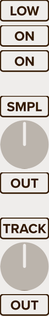</td>
    </tr>
    <tr>
        <td>INT</td>
        <td>ON</td>
        <td>Advance if the GATE is low
            at any point during the generate phase.
        </td>
    </tr>
    <tr>
        <td>SUST</td>
        <td>ON</td>
        <td>If the generate phase completes,
            continue emitting the sampled voltage
            until the GATE falls.
        </td>
    </tr>
    <tr>
        <td>Start Anchor</td>
        <td>SAMPL OUT</td>
        <td>Sample the previous step's final voltage.</td>
    </tr>
    <tr>
        <td>End Anchor</td>
        <td>TRACK OUT</td>
        <td>To continue emitting the sampled voltage.</td>
    </tr>
</table>

### Release Stage

<table>
    <tr>
        <th>Parameter</th>
        <th>Value</th>
        <th>Notes</th>
        <th>Image</th>
    </tr>
    <tr>
        <td>TRIG</td>
        <td>LOW</td>
        <td>If INT or SUST are ON,
            experiment with other GATE conditions here.
            If INT and SUST are both off,
            this setting does not matter.
        </td>
        <td rowspan="6">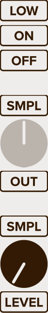</td>
    </tr>
    <tr>
        <td>INT</td>
        <td>ON</td>
        <td>This makes the step interruptible.
            Set INT OFF to make it uninterruptible.
        </td>
    </tr>
    <tr>
        <td>SUST</td>
        <td>OFF</td>
        <td>Variation:
            To combine the step with a sustain stage,
            turn SUST ON and set TRIG to LOW.
        </td>
    </tr>
    <tr>
        <td>Start Anchor</td>
        <td>SAMPL OUT</td>
        <td>To start the release at the previous step's final voltage.</td>
    </tr>
    <tr>
        <td>End Anchor</td>
        <td>SMPL LEVEL</td>
        <td>The most common end voltage is 0V.</td>
    </tr>
</table>

## Step Sequencers

### Externally Clocked Step Sequencer

To create a traditional,
**externally-clocked step sequencer**
that holds each level
until the _GATE_ rises,
configure each step liks this:

<table>
    <tr>
        <th>Parameter</th>
        <th>Value</th>
        <th>Notes</th>
        <th>Image</th>
    </tr>
    <tr>
        <td>TRIG</td>
        <td>RISE</td>
        <td>RISE is the traditional GATE condition to use here,
            but you can tune your step sequencer
            by specifying any condition.
            And you can use different conditions
            for different steps.</td>
        <td rowspan="6"></td>
    </tr>
    <tr>
        <td>INT</td>
        <td>ON</td>
        <td>Advance if the GATE rises while generating.</td>
    </tr>
    <tr>
        <td>SUST</td>
        <td>ON</td>
        <td>If the generate phase completes without interruption,
            sustain until the GATE rises.</td>
    </tr>
    <tr>
        <td>Start Anchor</td>
        <td>SMPL LEVEL</td>
        <td>Set the LEVEL to the desired voltage.</td>
    </tr>
    <tr>
        <td>End Anchor</td>
        <td>TRACK OUT</td>
        <td>To continue emitting the same voltage.</td>
    </tr>
</table>

The **INT** and **SUST** settings
cause the step
to advance _only_ when the _GATE_
satisfies the **TRIG** condition,
regardless of what phase (generate or sustain)
the step is executing.
This puts advancement
entirely under the control of the _GATE_.

### Timer-Controlled Step Sequencer

To create a **timer-controlled step sequencer**
that holds each level for a specified duration,
configure each step like this:

<table>
    <tr>
        <th>Parameter</th>
        <th>Value</th>
        <th>Notes</th>
        <th>Image</th>
    </tr>
    <tr>
        <td>INT</td>
        <td>OFF</td>
        <td>Emit the sampled voltage until the timer expires,
            ignoring the GATE condition.</td>
        <td rowspan="6"></td>
    </tr>
    <tr>
        <td>SUST</td>
        <td>OFF</td>
        <td>Advance automatically when the timer expires.</td>
    </tr>
    <tr>
        <td>Start Anchor</td>
        <td>SMPL LEVEL</td>
        <td>Set the LEVEL to the desired voltage.</td>
    </tr>
    <tr>
        <td>End Anchor</td>
        <td>TRACK OUT</td>
        <td>Emit a constant voltage.</td>
    </tr>
    <tr>
        <td>DUR</td>
        <td>desired duration</td>
        <td>The duration of the step's timer.</td>
    </tr>
</table>

The **INT** and **SUST** settings
cause the step to ignore the GATE,
putting advancement entirely under the control
of the step's **DUR** timer.

## Sample and Hold Sequencers

### Externally-Clocked Sample and Hold Sequencer

To create a multi-step, externally-clocked
sample-and-hold sequencer
where each step advances on a different _GATE_ condition,
configure each step liks this:

<table>
    <tr>
        <th>Parameter</th>
        <th>Value</th>
        <th>Notes</th>
        <th>Image</th>
    </tr>
    <tr>
        <td>TRIG</td>
        <td>any</td>
        <td>Different steps can advance on different GATE conditions.</td>
        <td rowspan="6"></td>
    </tr>
    <tr>
        <td>INT</td>
        <td>ON</td>
        <td>Advance if the GATE condition is satisfied while generating.</td>
    </tr>
    <tr>
        <td>SUST</td>
        <td>ON</td>
        <td>If the generate phase completes without interruption,
            sustain until the GATE condition is satisfied.</td>
    </tr>
    <tr>
        <td>Start Anchor</td>
        <td>SMPL any input</td>
        <td>Different steps can sample different inputs.</td>
    </tr>
    <tr>
        <td>End Anchor</td>
        <td>TRACK OUT</td>
        <td>To continue emitting the same voltage.</td>
    </tr>
</table>

The **INT** and **SUST** settings
cause the step
to advance _only_ when the _GATE_
satisfies the **TRIG** condition,
regardless of what phase (generate or sustain)
the step is executing.
This puts advancement
entirely under the control of the _GATE_.

### Timer-Controlled Sample and Hold Sequencer

To create a multi-step, timer-controlled sample-and-hold sequencer
where each step holds for a different duration,
configure each step liks this:

<table>
    <tr>
        <th>Parameter</th>
        <th>Value</th>
        <th>Notes</th>
        <th>Image</th>
    </tr>
    <tr>
        <td>INT</td>
        <td>OFF</td>
        <td>Emit the sampled voltage until the timer expires,
            ignoring the GATE condition.</td>
        <td rowspan="6"></td>
    </tr>
    <tr>
        <td>SUST</td>
        <td>OFF</td>
        <td>Advance automatically when the timer expires.</td>
    </tr>
    <tr>
        <td>Start Anchor</td>
        <td>SMPL any input</td>
        <td>Different steps can sample different inputs</td>
    </tr>
    <tr>
        <td>End Anchor</td>
        <td>TRACK OUT</td>
        <td>Emit a constant voltage.</td>
    </tr>
    <tr>
        <td>DUR</td>
        <td>desired duration</td>
        <td>The duration of the step's timer.</td>
    </tr>
</table>

The **INT** and **SUST** settings
cause the step to ignore the GATE,
putting advancement entirely under the control
of the step's **DUR** timer.
