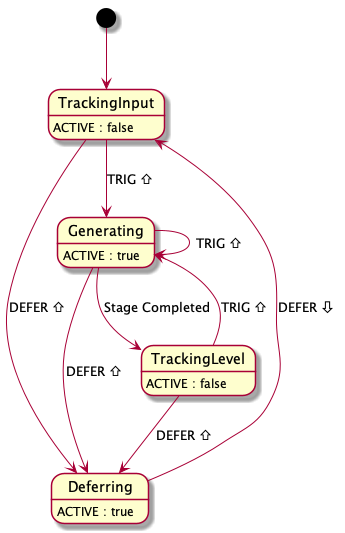

Generates a single envelope stage.

Combine
[_Stage_](/modules/stage/),
[_Booster Stage_](/modules/booster-stage/),
[_Hostage_](/modules/hostage/),
and [_Upstage_](/modules/upstage/)
modules
to generate complex envelopes
with any number of stages.

See also:

- [Generating Single-Stage Envelopes](/guides/generating-single-stage-envelopes/)
- [Generating Multi-Stage Envelopes](/guides/generating-multi-stage-envelopes/)
- [How Stages Work Together](/technical/how-stages-work-together)
- [J and S Curves](/technical/curves/)

## Controls

- **LEVEL:**
    The voltage level at which each generated envelope stage ends.
    The range is 0–10V.

- **CURVE:**
    The
    [curvature](/technical/curves/)
    of the envelope stage.

- **DURATION:**
    The duration of the envelope stage.
    The range is 10ms–10s,
    with the center position
    giving a duration of 1s.

## Ports

- **DEFER:**
    When the _DEFER_ gate signal is high,
    _Stage_ **_defers_** to its _IN_ signal,
    forwarding the _IN_ signal
    directly to the _OUT_ output.

    When it begins deferring,
    _Stage_ abandons any envelope stage
    it may have been generating.

- **TRIG:**
    When triggered,
    _Stage_ generates an envelope stage,
    starting at the voltage sampled from the _IN_ signal.

    While _Stage_ is deferring,
    it ignores incoming triggers.

- **IN:**
    When _Stage_ generates an envelope stage,
    the stage starts
    at the voltage sampled from the _IN_ signal.

    While _Stage_ is _deferring_,
    it forwards the _IN_ signal directly to its _OUT_ output.

- **ACTIVE:**
    A 10V gate signal indicating that _Stage_
    is either actively generating an envelope stage
    or deferring to its _IN_ signal.

- **EOC:**
    When _Stage_ completes an envelope stage,
    it emits a 1 millisecond 10V pulse
    at its _EOC_ output.

- **OUT:**
    The generated envelope stage signal
    or (when deferring) the _IN_ signal.

## Notes

- While an envelope stage is in progress,
  all of the knobs are "live."
  If you adjust a knob,
  _Stage_ applies the new value
  to the remainder of the stage.

- Before _Stage_ first becomes active
  (by either a trigger or a _DEFER_ gate),
  it "tracks" its input
  by sending its _IN_ voltage to its _OUT_ port.
  Stage also enters this mode
  when its _DEFER_ gate falls (unless the _TRIG_ port is high). 

- After _Stage_ completes an envelope stage,
  it "tracks" the _LEVEL_ knob
  by sending the _LEVEL_ voltage to the _OUT_ port.

## State Model

### TrackingInput Mode
_Stage_ starts in _TrackingInput_ mode.
While _Stage_ is _TrackingInput_:
- it is inactive
- it "tracks" its input by sending its _IN_ voltage to its _OUT_ port
- if _DEFER_ rises, _Stage_ enters _Deferring_ mode 
- if _TRIG_ rises, _Stage_ enters _Generating_ mode

### Deferring Mode

Whatever mode _Stage_ is in,
whenever its _DEFER_ gate rises,
it enters _Deferring_ mode.
While _Stage_ is _Deferring:

- it is active
- it sends its _IN_ voltage to its _OUT_ port
- it ignores its _TRIG_ port

When the _DEFER_ gate falls,
_Stage_ resumes _TrackingInput_.

### Generating Mode

If the _TRIG_ port rises
while _Stage_ is not _Deferring_,
it begins _Generating_ a stage.
While _Stage_ is _Generating_:

- it is active
- it advances its phase and generates the appropriate voltage at its _OUT_ port
- if the stage completes,
  _Stage_ initiates a short pulse on its _EOC_ port
  and enters _TrackingLevel_ mode
- if _DEFER_ rises, _Stage_ enters _Deferring_ mode 
- if _TRIG_ rises, _Stage_ abandons the stage it is generating and begins a new one

### TrackingLevel Mode

While _Stage_ is _TrackingLevel_:

- it is inactive
- it sends the voltage of its _LEVEL_ knob to its _OUT_ port
- if _DEFER_ rises, _Stage_ enters _Deferring_ mode 
- if _TRIG_ rises, _Stage_ enters _Generating_ mode
