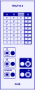

Customizable truth tables with 2, 3, or 4 inputs.

_Truth 3_ is shown, and described below.
_Truth 2_ and _Truth 4_ offer similar functionality,
with 2 and 4 inputs, respectively.

# Controls

## Inputs
- **A**, **B**, and **C/GATE:**
    The input signals for the truth table.
    A voltage above 0.5V (half a volt)
    is considered _high_.
    A voltage of 0.5V or below
    is considered _low_.

    Beside each input is an override button
    that sets the input signal high while pressed.

## The Truth Table

### Columns

-   The **A** and **B** columns
    represent the **A** and **B** inputs.
    The column is true if the input is high.

-   The third column represents the _condition_ of the **C/GATE** input.
    The button at the top of the column
    selects a condition to apply to the **C/GATE** signal.
    When the signal satisfies the condition,
    the column is true.

    The conditions are:

    - _HIGH:_ The gate is high.
    - _LOW:_ The gate is low.
    - _RISE:_ The gate rises.
    - _FALL:_ The gate falls.
    - _EDGE:_ The gate changes (rises or falls).

    See [Usage Notes](#usage-notes) for ideas about how to use the conditions.

-  The **Q** column
    selects the result of the truth table
    for each possible state of the inputs.

### Rows

-   Below the dark header row,
    the truth table has eight more rows,
    one for each possible state of the inputs.

-   In each row,
    the first three columns
    represent a possible state of the three inputs.

-   The button in the **Q** column
    selects the result of the truth table
    when the inputs match the row's state.
    The possible results are:
   
    -   _T:_ Emit 10V.
    -   _F:_ Emit 0V.
    -   _Q:_ Leave the output unchanged.
    -   _¬Q:_ Toggle the output.

## Outputs

-   The **Q** output
    emits the result of the truth table
    for the given inputs.
    10V represents true,
    and 0V represents false.

-   **¬Q:** emits the negation of Q.

-   Beside each output is a button
    that momentarily sets the output to true
    and the other output to false.

# Usage Notes

## Level-Triggered vs Edge-Triggered

**Level-Sensitive.**
The _HIGH_ and _LOW_ conditions
make the table
sensitive to the _level_
of the **C/GATE** input.
This makes the **C/GATE** input
useful as an _enable_ signal,
such as for a _D Latch._

**Edge-Triggered.**
The _RISE_, _FALL_, and _EDGE_ conditions
make the table _edge-triggered._
This makes the **C/GATE** input
useful as a _clock_ signal,
allowing changes only at precise moments,
when the clock rises or falls.

Note that _RISE_, _FALL_, and _EDGE_
are _single sample_ events.

## Caution: Selecting the ¬Q Result

Because the _¬Q_ result
causes the table's output to toggle,
it tends to be useful
only for edge-triggered rows.
That is, only when:

-   The **C/GATE** button
    selects an edge-triggered condition
    (_RISE_, _FALL_, or _EDGE_).
-   The row's value for the gate column is _T._

To see why, consider:
If the row is level-triggered,
it might be selected
for many samples in a row.
On each sample,
the output toggles,
producing a square wave
at the Nyquist frequency.
That's probably not what you want.
