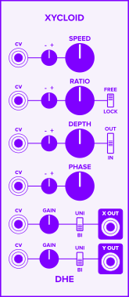

Xycloid
traces a fixed point
on the edge a circle
rolling along the inside or outside
of another circle.

The resulting two-dimensional shape
generates a pair of complex, evolving, pulsing LFO signals.

See:
- **[Throb, Wobble, and Accent](https://www.youtube.com/watch?v=Kc0WctuFNvY):**
    My Xycloid tutorial on YouTube.
- **[The v0.6.1 manual](v0.6.1/):**
    More fun and less helpful than the current manual.

## Controls
- **SPEED:**
    The throb cycle frequency.

- **RATIO:**
    The number of wobble cycles
    per throb cycle.

    **Note:**
    With the _IN / OUT_ switch
    in the center position,
    the _RATIO_ knob
    determines both the *rate* and *direction*
    in which the wobble angle advances.
    Clockwise rotation
    advances the wobble angle
    in the same direction
    as the throb angle.
    Counterclockwise rotation
    advances the wobble angle
    in the opposite direction.

- **FREE / LOCK:**
    Determines whether to round the _RATIO_ value
    to the nearest integer.

    _LOCK_ rounds the _RATIO_ value
    to the nearest integer,
    causing _Xycloid's_ pattern of accents
    to repeat on every throb cycle.

    _FREE_ allows non-integer _RATIO_ values,
    which lets the accents
    vary from one throb cycle to the next.

- **DEPTH:**
    The dominance of the wobble cycle in the output signals.

- **IN / OUT:**
    Determines the direction in which
    the wobble angle advances
    compared to the throb angle.

    _IN_ advances the wobble angle
    in the same direction
    as the throb angle.
    This produces "inward" nodes
    when the _X_ and _Y_ signals
    are plotted on an X/Y graph.

    _OUT_ advances the wobble angle
    in the opposite direction
    from the throb angle.
    This produces "outward" nodes
    when the _X_ and _Y_ signals
    are plotted on an X/Y graph.

    With this switch in the center position
    the _RATIO_ knob
    determines the direction
    in which the wobble angle advances.

- **PHASE:**
    Offsets the phase of the wobble angle.

    This has the effect
    of shifting the accents
    produced when the wobble and throb cycles
    peak.

## Ports
- **X OUT** and **Y OUT:**
    The output signals.

    The polarity switch **(UNI / BI)**
    selects the voltage range of the associated output signal.
    0 to 10V (UNI)
    or -5 to 5V (BI).

    The **GAIN** knob applies gain (from 0 to 2)
    to the signal.

    _Xycloid_ selects the range before applying the gain.

- **CV:**
    A [control voltage](/technical/modulation/) signal
    to modulate the associated parameter.  Some CV signals have attenuverters.

## Using Xycloid

- Adjust the _SPEED_ knob to control the frequency of the throb cycle, and
  therefore the frequency of the overall pattern.
- Adjust the _RATIO_ knob to control the number of wobble cycles within each
  throb cycle.
- Adjust the _DEPTH_ knob to control whether the throb cycle, the wobble cycle,
  or neither cycle dominates the overall pattern
- Adjust the _PHASE_ knob to shift the position of the wobbles within the throb
  cycle, which determines where the accents fall within each throb.
- _FIXED_ mode produces a whole number of wobbles for each throb.  As a result,
  the pattern of accents repeats exactly from one throb cycle to the next.
- _FREE_ mode allows the pattern of wobbles to drift over time.  This can
  create yet another, longer cycle in the pattern of accents.
- For extra chaos, modulate Xycloid's controls.
- For extra, extra chaos, use Xycloid's outputs to modulate its own controls.

Xycloid's _X_ and _Y_ outputs are always **similar, but never identical** to
each other.  You can use relationship to create interesting interactions
between parameters:

- Modulate two closely related parameters.
- Modulate two parameters that have nothing to do with each other.
- Modulate the same parameter on different modules.

## Plotting Xycloid

When plotted on a two-dimensional graph,
Xycloid's _X_ and _Y_ signals
produce a visually pleasing shape,
which can be either a
_[hypotrochoid](https://en.wikipedia.org/wiki/Hypotrochoid)_
or an
_[epitrochoid](https://en.wikipedia.org/wiki/Epitrochoid)._

To view the shape that Xycloid produces, connect its _X_ and _Y_ outputs to a
Scope's _X_ and _Y_ inputs.  Set the scope to _X x Y_ mode.  Note that the
scope's _X/Y_ mode can also be interesting.
