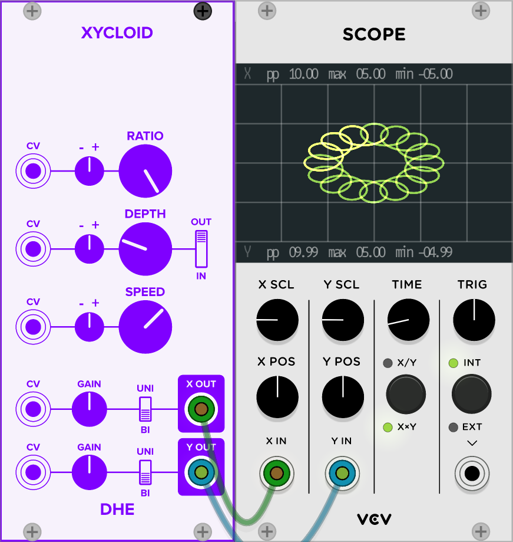

Generates a [cyclically related pair](#examples) of compound LFO signals.

Check the [usage guide](#using-xycloid).

Or better yet, just **play with the knobs.**

# Controls
- **RATIO:**
    Determines the number of "lobes" or "cusps" or "nodes" in the shape.

- **DEPTH:**
    How far the shape extends from its outer edge.

    Note that with the knob at either extreme,
    the shape is a circle.

- **IN / OUT:**
    This "curl direction" switch
    determines whether the lobes curl
    toward the inside or the outside of the shape.

    It also determines the range of the _RATIO_ knob.
    With the switch set to _IN_ or _OUT_,
    the *RATIO* knob ranges from 0 to 16 lobes.
    With the switch in the center,
    the *RATIO* knob ranges from 16 inward lobes
    (fully counterclockwise)
    to 16 outward lobes
    (fully clockwise).

- **SPEED:**
    The speed at which the shape is drawn.
    Turn the knob counterclockwise to reverse the shape's direction.

    Note that the **RATIO** knob
    (and to some extent the **DEPTH** knob)
    can also affect the speed
    in counterintuitive ways.

# Ports
- **X OUT** and **Y OUT:**
    The output signals.

    The polarity switch **(UNI / BI)**
    selects the nominal range of the signal:
    Either 0 to 10V (UNI)
    or -5 to 5V (BI).

    The **GAIN** knob applies gain (from 0 to 2)
    to the signal.

    The range is selected before gain is applied.

- **CV:**
    Control voltage signal that modulates the associated knob.
    The modulation is calibrated so that:
    - A 0V _CV_ signal yields the value of the knob.
    - A 5V _CV_ signal yields the value
        as if the knob were rotated 50%
        clockwise
        of its actual position.
    - A -5V _CV_ signal yields the value
        as if the knob were rotated 50%
        counterclockwise
        of its actual position.

    Some of the _CV_ ports
        are accompanied by a small *attenuverter* (**- +**) knob.
        This knob adjusts the strength and direction
        of the the _CV_ signal's effect
        on the modulated knob.

# Using Xycloid

1. Choose one or two Rack modules that you want to modulate.
1. Choose two parameters that have CV modulation.
1. Connect Xycloid's _X_ output to one parameter's CV input
    and the _Y_ output to the other's.
1. (Optional)
   To view the shape that Xycloid produces,
   connect its _X_ and _Y_ outputs to a Scope's _X_ and _Y_ inputs.
   Set the scope to _XxY_ mode.
   (_X/Y_ mode can also be interesting.)
1. **Play with the knobs.**
1. For extra chaos,
    modulate Xycloid's controls.
1. For extra, extra chaos,
    use Xycloid's outputs
    to modulate its own controls.

**The Audible Instruments Macro Oscillator**
is a fantastic choice for exploring what Xycloid can do.
Attach Xycloid's _X_ and _Y_ outputs
to the Macro Oscillator's _TIMBRE_ and _COLOR_ inputs.
Modulating _V/OCT_ and _FM_ is also fun.

Then **play with the knobs.**

**More stuff to try:**

- Modulate two closely related parameters.
- Modulate two parameters that have nothing to do with each other.
- Modulate the same parameter on different modules.
    For example,
    modulate the _PWM_ input on two Fundamental VCO-1s.
    Or the _FM_ inputs.

# Examples

## The Default Settings

The default settings
draw a shape
with eight lobes that touch in the center:

## Adjusting the Ratio

With the switch _IN_ or _OUT_,
the center position on the ratio knob draws eight lobes:

A lower ratio draws fewer lobes:

A higher ratio draws more lobes:

## Adjusting the Depth

With a lower depth,
the lobes never stray far
from the outer edge of the shape:

As depth increases,
the lobes dip closer to the center of the shape:

As the depth approaches the center position,
the lobes approach the center of the shape:

With the depth in the center position,
each lobe touches the center of the shape:

As depth increases,
each lobe loops around the center of the shape:

## Adjusting the Curl Direction (the IN / OUT Switch)

With the switch _OUT_,
the lobes curl outward:

With the switch _IN_,
the lobes curl inward:

With the switch in the center,
the _RATIO_ knob determines
which way the lobes curl.

# My Inspiration

Okay, so remember when you were a kid,
and [you had a toy](https://en.wikipedia.org/wiki/Spirograph)
where you stuck a pen in a hole in a little plastic gear
and you rolled the gear around inside a plastic ring
to draw fun shapes?

That's what _Xycloid_ does.

If you want to know the math,
look up
[epitrochoid](https://en.wikipedia.org/wiki/Epitrochoid)
and
[hypotrochoid](https://en.wikipedia.org/wiki/Hypotrochoid).

But, seriously, don't worry about that.

Just **play with the knobs.**

# The Name

There is a kind of shape called a _cycloid._
Technically,
_Xycloid_ doesn't draw those.
Well,
technically,
it does.
Sort of.

But more preciesely,
_Xycloid_ draws [centered trochoids](https://en.wikipedia.org/wiki/Centered_trochoid).

So if the module draws centered trochoids,
why, oh, why
did I call _Xycloid?_

Because would you load a module called _Centered Trochoid?_

No.

No, you would not.

But don't worry about that.

Just **play with the knobs.**
