Several of the DHE Modules
apply a curved transfer function
to produce their output.
The transfer function comes in two shapes:

- [J curves](#j-curves)
- [S curves](#s-curves)

[_Stage_](/modules/stage/)
and
[_Booster Stage_](/modules/booster-stage/)
can generate J-shaped envelope stages.
In addition,
_Booster Stage_
can generate S-shaped stages.

[_Swave_](/modules/swave/)
can apply a J- or S-shaped transfer function
to shape its input.

[_Tapers_](/modules/tapers/)
can apply a J- or S-shaped taper
to the position of its _LEVEL_ knob.

Each module has a knob
that determines
the sign (positive or negative)
and magnitude of the curvature.
Positive curvature creates a J or S shape.
Negative curvature inverts the shape.
Extreme curvature (positive or negative)
creates a curve
so sharp as to be nearly square.

Each transfer function (J or S, positive or negative)
is produced by
Dino Dini's beautiful
[**normalized tunable sigmoid function**](/technical/sigmoid/).

# J Curves

## Positive J Curves

Rotating the _CURVE_ knob
clockwise from the center
_pushes the steep part of the curve to the right._

<table class="curves">
  <tr>
    <th>
      <svg xmlns="http://www.w3.org/2000/svg" xmlns:xlink="http://www.w3.org/1999/xlink" viewBox="0 0 12.7 12.7">
        <image width="100%" height="100%" x="0" y="0" xlink:href="knob.svg" />
      </svg>
    </th>
    <th>
      <svg xmlns="http://www.w3.org/2000/svg" xmlns:xlink="http://www.w3.org/1999/xlink" viewBox="0 0 12.7 12.7">
        <image width="100%" height="100%" x="0" y="0" xlink:href="knob.svg" transform="rotate(30 6.35 6.35)"/>
      </svg>
    </th>
    <th>
      <svg xmlns="http://www.w3.org/2000/svg" xmlns:xlink="http://www.w3.org/1999/xlink" viewBox="0 0 12.7 12.7">
        <image width="100%" height="100%" x="0" y="0" xlink:href="knob.svg" transform="rotate(60 6.35 6.35)"/>
      </svg>
    </th>
    <th>
      <svg xmlns="http://www.w3.org/2000/svg" xmlns:xlink="http://www.w3.org/1999/xlink" viewBox="0 0 12.7 12.7">
        <image width="100%" height="100%" x="0" y="0" xlink:href="knob.svg" transform="rotate(90 6.35 6.35)"/>
      </svg>
    </th>
    <th>
      <svg xmlns="http://www.w3.org/2000/svg" xmlns:xlink="http://www.w3.org/1999/xlink" viewBox="0 0 12.7 12.7">
        <image width="100%" height="100%" x="0" y="0" xlink:href="knob.svg" transform="rotate(120 6.35 6.35)"/>
      </svg>
    </th>
    <th>
      <svg xmlns="http://www.w3.org/2000/svg" xmlns:xlink="http://www.w3.org/1999/xlink" viewBox="0 0 12.7 12.7">
        <image width="100%" height="100%" x="0" y="0" xlink:href="knob.svg" transform="rotate(150 6.35 6.35)"/>
      </svg>
    </th>
  </tr>
  <tr>
    <td>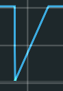</td>
    <td>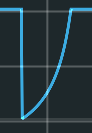</td>
    <td>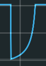</td>
    <td>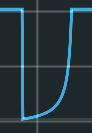</td>
    <td>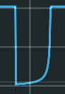</td>
    <td>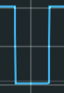</td>
  </tr>
</table>

**Note:**
Extreme positive curvature
makes the curve almost
square at the end.

## Negative J Curves

Rotating the _CURVE_ knob
counterclockwise from the center
_pushes the steep part of the curve to the left._

<table class="curves">
  <tr>
    <th>
      <svg xmlns="http://www.w3.org/2000/svg" xmlns:xlink="http://www.w3.org/1999/xlink" viewBox="0 0 12.7 12.7">
          <image width="100%" height="100%" x="0" y="0" xlink:href="knob.svg" />
      </svg>
    </th>
    <th>
      <svg xmlns="http://www.w3.org/2000/svg" xmlns:xlink="http://www.w3.org/1999/xlink" viewBox="0 0 12.7 12.7">
        <image width="100%" height="100%" x="0" y="0" xlink:href="knob.svg" transform="rotate(-30 6.35 6.35)"/>
      </svg>
    </th>
    <th>
      <svg xmlns="http://www.w3.org/2000/svg" xmlns:xlink="http://www.w3.org/1999/xlink" viewBox="0 0 12.7 12.7">
        <image width="100%" height="100%" x="0" y="0" xlink:href="knob.svg" transform="rotate(-60 6.35 6.35)"/>
      </svg>
    </th>
    <th>
      <svg xmlns="http://www.w3.org/2000/svg" xmlns:xlink="http://www.w3.org/1999/xlink" viewBox="0 0 12.7 12.7">
        <image width="100%" height="100%" x="0" y="0" xlink:href="knob.svg" transform="rotate(-90 6.35 6.35)"/>
      </svg>
    </th>
    <th>
      <svg xmlns="http://www.w3.org/2000/svg" xmlns:xlink="http://www.w3.org/1999/xlink" viewBox="0 0 12.7 12.7">
         <image width="100%" height="100%" x="0" y="0" xlink:href="knob.svg" transform="rotate(-120 6.35 6.35)"/>
       </svg>
    </th>
    <th>
      <svg xmlns="http://www.w3.org/2000/svg" xmlns:xlink="http://www.w3.org/1999/xlink" viewBox="0 0 12.7 12.7">
        <image width="100%" height="100%" x="0" y="0" xlink:href="knob.svg" transform="rotate(-150 6.35 6.35)"/>
      </svg>
    </th>
  </tr>
  <tr>
    <td></td>
    <td>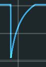</td>
    <td>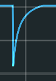</td>
    <td>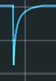</td>
    <td>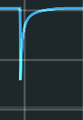</td>
    <td>—</td>
  </tr>
</table>

**Notes:**
- Each curve
    actually starts at the same voltage.
    But as the curvature becomes more negative,
    the rise is so fast that the Scope
    can't display the initial value.
- With the knob fully counterclockwise,
    the rise is so fast
    that the Scope can't show it at all.
    That's why there's no image.
- Extreme positive curvature
    makes the curve almost
    square at the start.
    Given that there's no image,
    you'll have to trust me
    about this.
    Or try it yourself.

# S Curves

## Positive S Curves

Rotating the _CURVE_ knob
clockwise from the center
_steepens the middle of the S curve._

<table class="curves">
  <tr>
    <th>
      <svg xmlns="http://www.w3.org/2000/svg" xmlns:xlink="http://www.w3.org/1999/xlink" viewBox="0 0 12.7 12.7">
        <image width="100%" height="100%" x="0" y="0" xlink:href="knob.svg" />
      </svg>
    </th>
    <th>
      <svg xmlns="http://www.w3.org/2000/svg" xmlns:xlink="http://www.w3.org/1999/xlink" viewBox="0 0 12.7 12.7">
        <image width="100%" height="100%" x="0" y="0" xlink:href="knob.svg" transform="rotate(30 6.35 6.35)"/>
      </svg>
    </th>
    <th>
      <svg xmlns="http://www.w3.org/2000/svg" xmlns:xlink="http://www.w3.org/1999/xlink" viewBox="0 0 12.7 12.7">
        <image width="100%" height="100%" x="0" y="0" xlink:href="knob.svg" transform="rotate(60 6.35 6.35)"/>
      </svg>
    </th>
    <th>
      <svg xmlns="http://www.w3.org/2000/svg" xmlns:xlink="http://www.w3.org/1999/xlink" viewBox="0 0 12.7 12.7">
        <image width="100%" height="100%" x="0" y="0" xlink:href="knob.svg" transform="rotate(90 6.35 6.35)"/>
      </svg>
    </th>
    <th>
      <svg xmlns="http://www.w3.org/2000/svg" xmlns:xlink="http://www.w3.org/1999/xlink" viewBox="0 0 12.7 12.7">
        <image width="100%" height="100%" x="0" y="0" xlink:href="knob.svg" transform="rotate(120 6.35 6.35)"/>
      </svg>
    </th>
    <th>
      <svg xmlns="http://www.w3.org/2000/svg" xmlns:xlink="http://www.w3.org/1999/xlink" viewBox="0 0 12.7 12.7">
        <image width="100%" height="100%" x="0" y="0" xlink:href="knob.svg" transform="rotate(150 6.35 6.35)"/>
      </svg>
    </th>
  </tr>
  <tr>
    <td>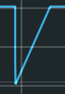</td>
    <td>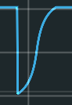</td>
    <td>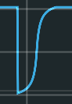</td>
    <td>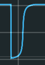</td>
    <td>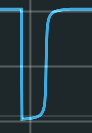</td>
    <td>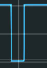</td>
  </tr>
</table>

**Note:**
Extreme positive curvature
makes the curve almost
square just before and after the middle.

## Negative S Curves

Rotating the _CURVE_ knob
counterclockwise from the center
_flattens the middle of the S curve._

<table class="curves">
    <tr>
    <th>
      <svg xmlns="http://www.w3.org/2000/svg" xmlns:xlink="http://www.w3.org/1999/xlink" viewBox="0 0 12.7 12.7">
          <image width="100%" height="100%" x="0" y="0" xlink:href="knob.svg" />
      </svg>
    </th>
    <th>
      <svg xmlns="http://www.w3.org/2000/svg" xmlns:xlink="http://www.w3.org/1999/xlink" viewBox="0 0 12.7 12.7">
        <image width="100%" height="100%" x="0" y="0" xlink:href="knob.svg" transform="rotate(-30 6.35 6.35)"/>
      </svg>
    </th>
    <th>
      <svg xmlns="http://www.w3.org/2000/svg" xmlns:xlink="http://www.w3.org/1999/xlink" viewBox="0 0 12.7 12.7">
        <image width="100%" height="100%" x="0" y="0" xlink:href="knob.svg" transform="rotate(-60 6.35 6.35)"/>
      </svg>
    </th>
    <th>
      <svg xmlns="http://www.w3.org/2000/svg" xmlns:xlink="http://www.w3.org/1999/xlink" viewBox="0 0 12.7 12.7">
        <image width="100%" height="100%" x="0" y="0" xlink:href="knob.svg" transform="rotate(-90 6.35 6.35)"/>
      </svg>
    </th>
    <th>
      <svg xmlns="http://www.w3.org/2000/svg" xmlns:xlink="http://www.w3.org/1999/xlink" viewBox="0 0 12.7 12.7">
         <image width="100%" height="100%" x="0" y="0" xlink:href="knob.svg" transform="rotate(-120 6.35 6.35)"/>
       </svg>
    </th>
    <th>
      <svg xmlns="http://www.w3.org/2000/svg" xmlns:xlink="http://www.w3.org/1999/xlink" viewBox="0 0 12.7 12.7">
        <image width="100%" height="100%" x="0" y="0" xlink:href="knob.svg" transform="rotate(-150 6.35 6.35)"/>
      </svg>
    </th>
  </tr>
  <tr>
    <td></td>
    <td>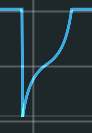</td>
    <td>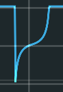</td>
    <td>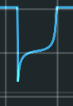</td>
    <td>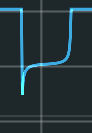</td>
    <td>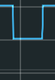</td>
  </tr>
</table>

**Notes:**
- Extreme negative curvature
    makes the curve almost
    square at both ends.
- Each curve
    actually starts at the same voltage.
    But as the curvature becomes more negative,
    the rise is so fast that the Scope
    can't display the initial value.
- With the knob fully counterclockwise,
    the rise is so fast
    that the Scope can't show the initial rise at all.
