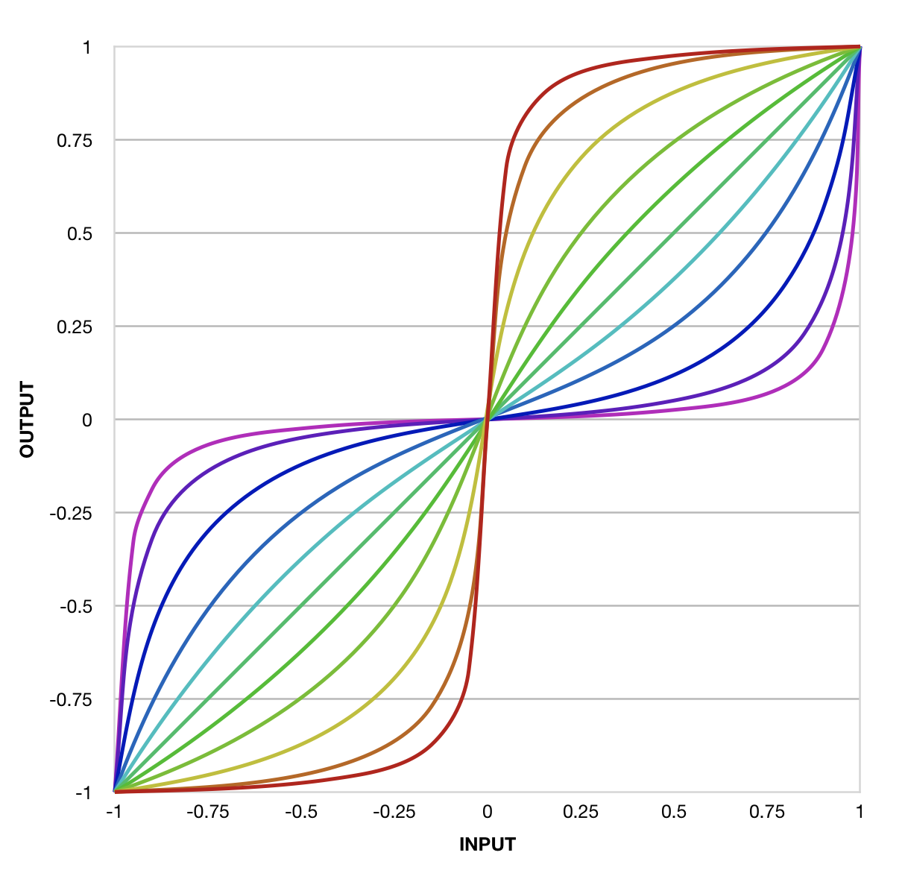

- [The Function](#function)
- [Curved Envelope Stages](#stages)
- [Waveshaping](#waveshaping)
- [Other Uses](#other)

**See also:**

- [Interact with the normalized tunable sigmoid function](https://www.desmos.com/calculator/aksjkh9das)
    on _Desmos.com,_
    a fun interactive graphing website.
- [On Youtube](https://www.youtube.com/watch?v=R5IZyQpYvZA):
    Watch Dino Dini improve his original normalized tunable sigmoid function.
    _DHE Modules_ uses the improved version.

## The Function

As I looked for a way
to shape envelope stages,
I stumbled across Dino Dini's beautiful
[_normalized tunable sigmoid function_](#function):

> $$y = \frac{x - kx}{k - 2k|x| + 1}$$

By _beautiful,_
I don't mean that the function looks nice
(though it looks very nice).
I mean that it has three features
that make it enormously useful for my purposes:

- **[Normalized](#normalized):**
    It applies in a particularly useful way
    to numbers in two particularly useful ranges:
    [-1,1] and [0,1].
- **[Tunable](#tunable):**
    A single parameter
    (_k_ or _curvature_)
    adjusts the curve
    in particularly useful ways.
- **[Sigmoid](#sigmoid):**
    It produces a particularly useful
    S-shaped curve.
    And because of the multiple ways it is normalized,
    it also produces a particularly useful
    J-shaped curve.

Here is a graph
of the the normalized tunable sigmoid function
for inputs from -1 to 1,
with each line representing a different curvature,
from -0.95 (red) to 0.95 (violet):

### Normalized

The function is _normalized_ in two interesting ways:
- Given an input in the range [-1,1],
    it yields an output
    in the range [-1,1].
- Given an input in the range [0,1],
    it yields an output
    in the range [0,1].

Note also that _for every value of k_:
- $$sigmoid(-1) = -1$$.
- $$sigmoid(0) = 0$$.
- $$sigmoid(1) = 1$$.

If I can map some linear signal
onto one of those "normal" ranges,
I can apply the sigmoid function
to shape the signal.

This is how the _DHE Modules_
create curved
[envelope stages](#stages)
and [waveshaper transfer functions](#waveshaping).

### Tunable

The normalized tunable sigmoid function
has a parameter,
_k,_
which tunes the _curvature_ of the function.
Each line in the graph
represents a different value of _k_.

Positive _k_
(from green to violet in the graph)
gives a J shape
over the range [0,1]
and an inverted S shape
over the range [-1,1].
Negative _k_
(from green to red in the graph)
gives a shape
that is nicely symmetrical
to the positive <em>k</em>s
_in either range._

And when $$k=0$$,
the function is linear:
$$y=x$$.
The output is the same as the input.

By mapping each module's _CURVE_ knob
to this function parameter _k,_
I give users control
over the curvature
of [envelope stages](#stages)
and [waveshaper transfer functions](#waveshaping).

**Note:**
For S-shaped curves,
the _DHE Modules_
negate the tuning parameter _k_
so that turning the _CURVE_ knob clockwise
gives an S curve
instead of an inverted S curve.

### Sigmoid

Originally I sought a function
that could produce useful, symmetrical "logarithmic" curves
for envelope stages.
My initial attraction to this
normalized tunable sigmoid function
was that in the range [0,1]
it produced exactly the kind of J curve
I was looking for.

But [playing with this curve](https://www.desmos.com/calculator/aksjkh9das)
got me thinking:
What if my modules could produce
[S shaped envelope stages](#stages)?
That would be a distinguishing feature!
And this function made S shaped envelope stages easy.

Then I wondered:
Might this function work well as a
[waveshaper transfer function](#waveshaping)?
And just like that, the idea for
[_Swave_](/modules/swave/)
was born.

## Curved Envelope Stages

[_Stage_](/modules/stage/)
and
[_Booster Stage_](/modules/booster-stage/)
use the normalised tunable sigmoid function
to produce curved envelope stages.

To produce an envelope stage,
each module follows the same general procedure:

1. Generate a _ramp_ signal that progresses from 0 to 1
    over the duration of the stage
1. Apply a shaping function
    to shape the ramp signal
    into a curve
1. Map the curved ramp signal
    onto the desired output range

For step 2,
each module shapes the ramp signal
by applying
the normalized tunable sigmoid function.

**J-Curved Envelope Stages:**
Given that the ramp signal is already in the range [0,1],
shaping the stage into a J curve is easy:
simply call the sigmoid function.

**S-Curved Envelope Stages:**
_Booster Stage_
can produce S-shaped stages.
To do this,
it applies the shaping function in three steps:

1. Map the ramp signal from [0,1] to [-1,1]
1. Apply the sigmoid function
1. Map the shaped signal back to [0,1]
    before scaling it to the desired output range

## Waveshaping

[_Swave_](/modules/swave/)
uses the normalized tunable sigmoid function
to shape its input signal.

**Note:**
_Swave_ assumes that its input signal
is in the range [-5V,5V],
the standard range
for audio and bipolar CV signals
in VCV Rack.

To shape its input signal,
_Swave:_

1. Maps the signal
    from [-5V,5V]
    to the range [0,1] (for J-curved waveshaping)
    or [-1,1] (for S-curved waveshaping)
1. Applies the sigmoid function
    to shape the signal
1. Maps the shaped signal
    back to the range [-5V,5V]
    for output

## Other Uses

In addition to shaping signals and generating envelope stages,
_DHE Modules_ use the sigmoid function
to give some knobs a _taper,_
making the knobs more or less senstive
at different parts of their rotation:

- Each _DURATION_ knob has a _J taper,_
    making it
    less sensitive near the counterclockwise extreme
    and more sensitive near the clockwise extreme
- Each _CURVE_ knob has an _S taper_,
    making it more sensitive in the center
    and less sensitive at the extremes
