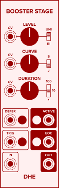
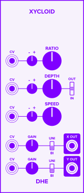
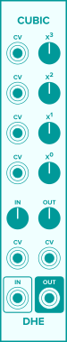
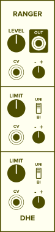
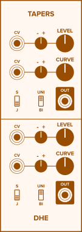

## The Modules

The DHE-Modules suite includes
[envelope generators](#envelope-generators),
[low frequency oscillators](#low-frequency-oscillators),
[utilities, and waveshapers](#utilities-and-waveshapers).

### Envelope Generators

**[_Stage_](modules/stage/)**
generates a single envelope stage.
Combine _Stages_ and other modules
to generate complex envelopes
with any number of stages.

**[_Booster Stage_](modules/booster-stage/)**
enhances _Stage's_ functionality,
adding CV inputs,
sigmoid curves,
buttons to inject triggers and other control signals,
and more.

**[_Hostage_](modules/hostage/)**
generates hold and sustain stages.

**[_Upstage_](modules/upstage/)**
adds special-purpose envelope controls
to
inject triggers,
suppress retriggers,
set an envelope's starting voltage,
and more.

### Low Frequency Oscillators

**[_Xycloid_](modules/xycloid/)**
produces a complex, pulsing,
_throb_ and _wobble_ LFO effect
with accents that either repeat or vary.

### Utilities and Waveshapers

**[_Cubic_](modules/cubic/)**
transforms its input signal by offsetting, scaling, squaring, and cubing it.

**[_Ranger_](modules/ranger/)**
(coming soon)
is a knob with an adjustable, modulatable range.

**[_Swave_](modules/swave/)**
is a waveshaper with a unique sigmoid transfer function.

**[_Tapers_](modules/tapers/)**
(coming soon)
is a pair of knobs with adjustable tapers.

## See Also

- [Generating Single-Stage Envelopes]({{ '/guides/generating-single-stage-envelopes/' | relative_url }})
- [Generating Multi-Stage Envelopes]({{ '/guides/generating-multi-stage-envelopes/' | relative_url }})
- [More Usage Ideas]({{ '/guides/' | relative_url }})
- [Technical Details]({{ '/technical/' | relative_url }})
