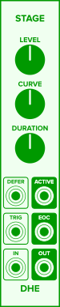
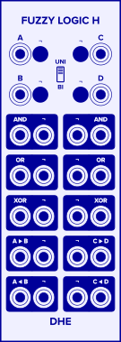
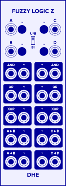
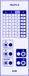
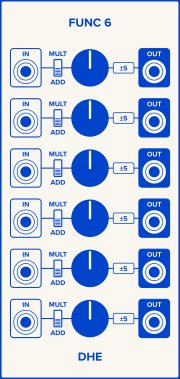

## The Modules

The DHE-Modules suite includes
[sequencers](#sequencers),
[envelope generators](#envelope-generators),
[logic modules](#logic),
[low frequency oscillators](#low-frequency-oscillators),
[utilities](#utilities).
and
[waveshapers](#waveshapers).

### Sequencers

**[_Sequencizer_](modules/sequencizer/)**
is a sequencer
that offers flexible, precise control
over the individual steps
and the overall sequence.

**[_Scannibal_](modules/scannibal/)**
is a scanned sequencer
that offers flexible, precise control
over the individual steps.

**[_Curve Sequencer_](modules/curve-sequencer/)**
is an earlier version of _Sequencizer._

_Sequencizer_, _Scannibal_, and _Curve Sequencer_
each come in three sizes: 4 steps, 8 steps, and 16 steps.

### Envelope Generators

**[_Stage_](modules/stage/)**
generates a single envelope stage.
Combine _Stages_ and other modules
to generate complex envelopes
with any number of stages.

**[_Booster Stage_](modules/booster-stage/)**
enhances _Stage's_ functionality,
adding CV inputs,
sigmoid curves,
buttons to inject triggers and other control signals,
and more.

**[_Hostage_](modules/hostage/)**
generates a hold or sustain envelope stage.

**[_Upstage_](modules/upstage/)**
adds special-purpose envelope controls
to
inject triggers,
suppress retriggers,
set an envelope's starting voltage,
and more.

### Logic

**[_Fuzzy Logic H_](modules/fuzzy-logic-h/)**
combines signals by applying fuzzy logic operators
based on hyperbolic paraboloids.

**[_Fuzzy Logic Z_](modules/fuzzy-logic-z/)**
combines signals by applying fuzzy logic operators
defined by Lofti Zadeh.

**[_Gator_](modules/gator/)**
computes eight common logic functions
for up to 16 inputs.

**Coming Soon:**
**[_Truth_](modules/truth/)**
is a customizable truth table
with 2, 3, or 4 inputs.

### Low Frequency Oscillators

**[_Blossom_](modules/blossom/)**
traces a point
around the edge of a circle
as the radius of the circle varies.

**[_Xycloid_](modules/xycloid/)**
traces a fixed point
on the edge a circle
rolling along the inside or outside
of another circle.

Each draws a pleasing, two-dimensional shape,
generating a pair of complex, evolving, pulsing LFO signals.

### Utilities

**[_Buttons_](modules/buttons/):**
8 toggle buttons with momentary negation.

**[_Cubic_](modules/cubic/)**
offsets, scales, squares, and cubes its input signal.

**[_Func_](modules/func/)**
is a knob with a selectable range to offset or scale its input signal.

**[_Func 6_](modules/func-6/)**
is a chain of knobs with selectable ranges to offset and scale input signals.

**[_Ranger_](modules/ranger/)**
is a modulatable knob with an adjustable, modulatable range.

**[_Tapers_](modules/tapers/)**
is a pair of modulatable knobs with adjustable, modulatable tapers.

### Waveshapers

**[_Swave_](modules/swave/)**
is a waveshaper with a unique sigmoid transfer function.

## See Also

- [Release Notes]({{ '/release-notes/' | relative_url }})
- [Generating Single-Stage Envelopes]({{ '/guides/generating-single-stage-envelopes/' | relative_url }})
- [Generating Multi-Stage Envelopes]({{ '/guides/generating-multi-stage-envelopes/' | relative_url }})
- [More Usage Ideas]({{ '/guides/' | relative_url }})
- [Technical Details]({{ '/technical/' | relative_url }})
