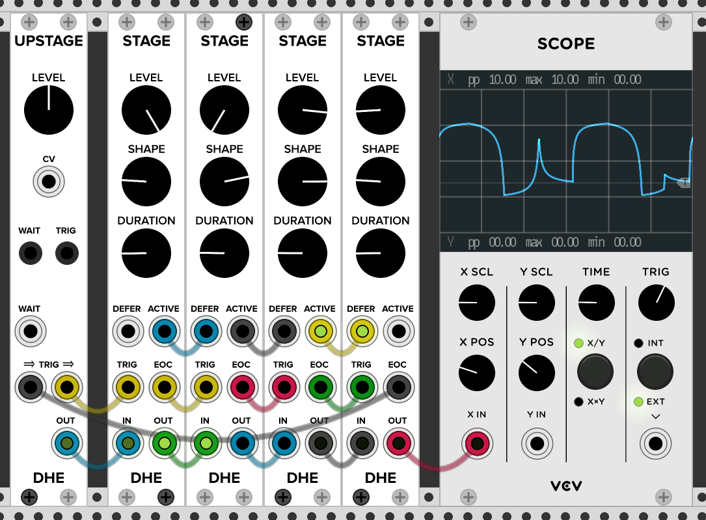

# DHE Modules for VCV Rack

VCV rack modules from Dale Emery.

Modules include:

- [[Stage]]: A chainable, single stage envelope generator.
- [[Upstage]]: Controls to enhance a chain of Stage modules.

With Stage and Upstage,
you can create a wide variety
of [[Single-Stage Envelopes]]
and [[Multi-Stage Envelopes]].

