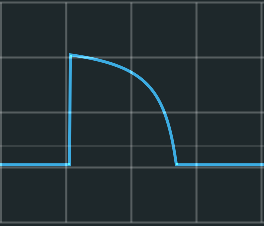
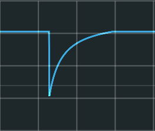
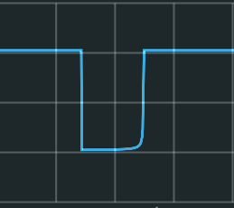
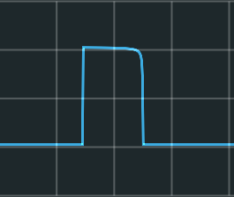
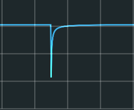
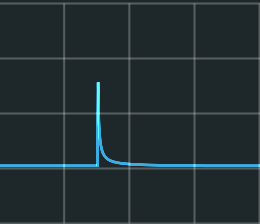

**Stage** is a chainable, single-stage envelope generator with shape control.

See:
- [Stage User Interface](#stage-user-interface)
- How to build [[Single-Stage Envelopes]]
- How to build [[Multi-Stage Envelopes]]
- [Technical Details: The Shape Knob](#technical-details:-the-shape-knob)
- [Technical Details: States and Events](#technical-details:-states-and-events)

## Stage User Interface

### Knobs

- **LEVEL** sets the ending voltage for the envelope segment.
  The range is 0 to 10 volts.

- **SHAPE** sets the shape of the segment.
  See [Technical Details: The Shape Knob](#technical-details:-the-shape-knob).

    The center position produces a *linear* stage.

    *Clockwise* and *counterclockwise* positions
    produce stages with curved shapes.

    Turning the knob clockwise
    *decreases* the initial slope of the envelope stage,
    yielding a shape similar to an exponential decay curve.
    Turning the knob counterclockwise
    *increases* the initial slope of the envelope stage,
    yielding a shape similar to a logarithmic decay curve.

    If that seems backward to you,
    think of the knob as pushing the steep part of the curve
    left or right.

    At extreme positions,
    the initial slope is very, very shallow (clockwise)
    or very, very steep (counterclockwise).

    See some [example shapes](#example-shapes) below.

- **DURATION** sets the duration of the envelope segment.
    The range is 0.001 to 10 seconds, with a duration of approximately 1 second at the center position.

### Input Ports

- **DEFER (gate):**
  When the *DEFER* gate is high,
  Stage defers to its input
  by emitting the voltage at the *IN* port,
  regardless of other settings.

- **TRIG (trigger):**
  A *TRIG* pulse starts the segment,
  beginning with the current *IN* port voltage.

- **IN (voltage):**
  An incoming envelope signal.

  As of v0.5.0 beta 4,
Stage does not limit the *IN* signal in any way.
If you send in four million volts,
Stage will send out four million volts.
(And yet the parrot will not VOOM.)

### Output Ports

- **ACTIVE (gate):**
  Indicates that this Stage is either
  generating an unfinished envelope segment
  or deferring to its input.

- **EOC (trigger):**
  Emits a short 10 volt pulse each time this Stage completes a segment.

- **OUT (voltage):**
  The envelope signal produced by this Stage.

## Technical Details: The Shape Knob

Stage applies this *normalized, tunable sigmoid curve function*
to shape its envelope stages:

where *x* is the current phase of an underlying sawtooth oscillator,
and *k* is the curvature,
determined (in a non-linear way)
by the *SHAPE* knob.

In particular,
Stage applies the upper right quadrant of the sigmoid curve,
which I discovered on the delightful and useful
[Desmos.com graphing calculator](https://www.desmos.com/calculator/aksjkh9das).

### Example Shapes

Turning the *SHAPE* knob moderately clockwise
produces a moderately shallow initial slope:

Turning the *SHAPE* knob moderately counterclockwise
produces a moderately steep initial slope:

Turning the *SHAPE* knob extremely clockwise
produces an extremely shallow initial slope:

Turning the *SHAPE* knob extremely counterclockwise
produces an extremely steep initial slope:

Note that even these "extreme" curves are not at the very ends of the knob's rotation.
At the very ends of the rotation,
the slope at either the start or the end of the stage
is so steep that I can't get a screenshot of it.
The scope can't display it properly.
You can see a little of the difficulty
in the bottom right image.
The actual peak is at 10 volts,
like the highest value in all of these images,
but the scope shows it peaking at approximately 8 volts.

## Technical Details: States and Events

At any time,
Stage can be one of four states,
each defined by what it emits at its *OUT* port.

- **[HOLDING](#holding):**
  Emits a fixed voltage, called the *hold* voltage.
- **[GENERATING](#generating):**
  Generates and emits an envelope
  according by the *DURATION, LEVEL,* and *CURVE* knobs.
- **[LEVELING](#leveling):**
  Emits the voltage of the *LEVEL* knob.
- **[DEFERRING](#deferring):**
  Emits the voltage of the *IN* port.
  That is, Stage *defers* to its input.

When Stage starts, it sets its *hold* voltage to 0.0 volts and begins *HOLDING.*

### Holding

When *HOLDING:*

- Stage emits its current *hold* voltage.
- All knobs are ignored.
- The *IN* port is ignored.
- If the *TRIG* port is triggered,
  Stage begins *GENERATING,*
  starting an envelope at the current *IN* voltage.
- If the *DEFER* gate goes high,
  Stage begins *DEFERRING.*

### Generating

When *GENERATING:*

- *Stage* emits an envelope
  that approaches the voltage set by the *LEVEL* knob,
  along a shape set by the *SHAPE* knob,
  over a duration set by the *DURATION* knob.
- Changes at the *DURATION, SHAPE,* and *LEVEL* knobs
  affect the envelope as it progresses.
- If the envelope reaches its end,
  Stage emits a pulse at its *EOC* (End of Cycle) port
  and begins *LEVELING.*
- If the *TRIG* port is triggered,
  Stage restarts the envelope at the current *IN* voltage
  and continues *GENERATING.*
- If the *DEFER* gate goes high,
  Stage terminates the envelope
  and begins *DEFERRING.*
  No *EOC* pulse is emitted.

### Leveling

When *LEVELING:*

- Stage emits the value of the *LEVEL* knob.
- If the *TRIG* port is triggered,
  Stage begins *GENERATING,*
  starting an envelope at the current *IN* voltage.
- If the *DEFER* gate goes high,
  Stage begins *DEFERRING.*

### Deferring

When *DEFERRING:*

- Stage emits the voltage at its *IN* port.
- The *TRIG* port is ignored.
- All knobs are ignored.
- If the *DEFER* gate goes low,
  Stage sets its *hold* voltage to the current *IN* port voltage
  and begins *HOLDING.*
